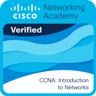
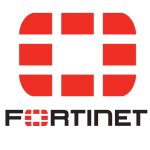
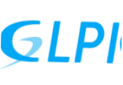
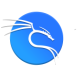
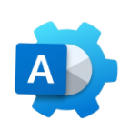

  

---

  

---

  

---

# 👋 Olá, Eu Sou o Bruno Gomes!

### 💻 Analista de Redes & Segurança da Informação | Apaixonado por Tecnologia & Cybersecurity 🔐

---

## 🚀 Sobre Mim

Sou um profissional dedicado, movido pela paixão em proteger e otimizar ambientes de TI corporativos, garantindo **segurança, performance e alta disponibilidade**.

- 🔥 Experiência sólida em **firewalls Fortinet, VPNs seguras, Active Directory, Linux e Windows Server**  
- 🛠️ Trabalho com ferramentas como **Zabbix, Grafana, GLPI, Office 365 Admin, Docker e Proxmox**  
- 🎓 Estudo constante para aprimorar conhecimentos em **CCNA, Fortinet NSE e Segurança Ofensiva/Defensiva (Kali Linux)**  
- 🎯 Meu foco: entregar soluções que unam **tecnologia, segurança e eficiência** para ambientes corporativos

---

## 🏆 Certificações

  
  &nbsp;&nbsp;&nbsp;
  

---

## 🛠️ Tecnologias & Ferramentas

  
  
  
  
  
  
  
  

---

## 💬 Vamos Conversar?

Se quiser trocar ideias sobre infraestrutura, redes, segurança ou tecnologia, estou aberto a colaborações e novos desafios!

  
  &nbsp;
  

